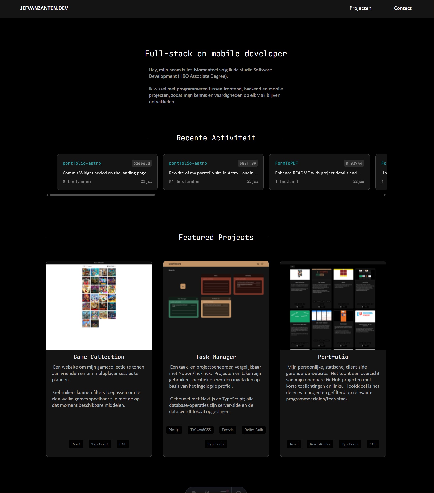

# Portfolio

Persoonlijke portfolio-website van Jef van Zanten, gebouwd met Astro en Svelte. De site toont uitgelichte projecten, een filterbare projectenpagina, recente GitHub-activiteit en een contactpagina met formulierintegratie.



## Wat deze repo bevat

- Een snelle statische portfolio-site met Astro
- Interactieve UI-delen in Svelte
- Projectcontent uit Markdown-bestanden in `src/data/projects`
- Een filterbare projectenpagina op categorie, taal en library
- Een GitHub commit-widget met snapshot fallback
- Een contactformulier dat een externe API aanspreekt wanneer die is geconfigureerd

## Stack

- `Astro 7`
- `Svelte 5`
- `TypeScript`
- `Playwright` voor end-to-end tests
- `@astrojs/markdown-satteri` voor Markdown-verwerking

## Pagina's en functionaliteit

### Home

De homepage bevat een korte introductie, CTA-links en uitgelichte projecten. Daarnaast wordt recente GitHub-activiteit geladen via een widget die eerst een ingebouwde snapshot toont en daarna in de browser probeert te verversen.

### Projecten

De projectenpagina wordt opgebouwd vanuit Markdown-frontmatter en beschrijvingen in `src/data/projects`. Bezoekers kunnen filteren op:

- categorie
- programmeertaal
- framework of library

De gekozen filters worden gesynchroniseerd met de URL, zodat gefilterde views deelbaar blijven.

### Contact

De contactpagina toont vaste contactgegevens en een formulier. Het formulier werkt alleen wanneer `PUBLIC_API_URL` is ingesteld; anders blijft het zichtbaar maar uitgeschakeld met een duidelijke melding.

## Projectstructuur

```text
/
|-- public/                  # statische assets zoals icons, fonts en screenshots
|-- src/
|   |-- assets/thumbs/       # geoptimaliseerde thumbnails voor Astro image imports
|   |-- components/          # Astro- en Svelte-componenten
|   |-- data/projects/       # projectcontent in Markdown
|   |-- lib/                 # GitHub data helpers
|   |-- pages/               # routes
|   |-- types/               # gedeelde types
|   |-- data.ts              # laadt en sorteert alle projecten
|   `-- Layout.astro         # globale layout en analytics hook
|-- tests/                   # Playwright E2E tests
|-- docs/                    # kleine interne documentatie
|-- astro.config.mjs
`-- package.json
```

## Installatie

### Vereisten

- `Node.js >= 18.20.8`
- `npm`

### Lokaal starten

```bash
npm install
npm run dev
```

De dev-server draait standaard op `http://localhost:4321`.

## Environment variables

Maak optioneel een `.env` bestand aan in de root.

```env
PUBLIC_API_URL=https://jouw-api.example.com
PUBLIC_GA_ID=G-XXXXXXXXXX
```

### Betekenis

- `PUBLIC_API_URL`: basis-URL voor het contactformulier. De site post naar `/email/send-email`.
- `PUBLIC_GA_ID`: schakelt Google Analytics in via de globale layout.

Als `PUBLIC_API_URL` ontbreekt, blijft de rest van de site gewoon werken.

## Scripts

| Script | Beschrijving |
| --- | --- |
| `npm run dev` | Start de lokale Astro dev-server |
| `npm run build` | Bouwt de productieversie naar `dist/` |
| `npm run preview` | Draait de gebouwde site lokaal |
| `npm run test:e2e` | Draait de Playwright end-to-end tests |
| `npm run astro -- --help` | Toont Astro CLI opties |

## Content beheren

Nieuwe projecten voeg je toe via een Markdown-bestand in `src/data/projects`. De frontmatter bepaalt onder meer:

- naam en slug
- categorie
- gebruikte talen en libraries
- cover- en thumbnail-afbeeldingen
- links naar live demo, repo of download
- `highlighted` voor uitgelichte projecten op de homepage

De projectbeschrijving zelf komt uit de Markdown-inhoud van het bestand.

## GitHub commit-widget

De commit-widget gebruikt een snapshot uit `src/data/github-commits-snapshot.json` als startdata. In de browser probeert de widget daarna publieke GitHub-data te verversen en cachet die kort in `sessionStorage` voor snellere herhaalde bezoeken.

## Testen

De Playwright-test in `tests/projects-page.spec.ts` controleert onder meer:

- het open- en dichtklappen van de filters
- de layout van de filtergroepen
- filtering op categorie en taal
- resetgedrag en URL-synchronisatie

## Deployment

Deze repo bouwt naar een statische `dist/` output via Astro. Daardoor is deployment eenvoudig op elke host die statische sites ondersteunt, zolang eventuele externe API's los beschikbaar zijn voor het contactformulier.
